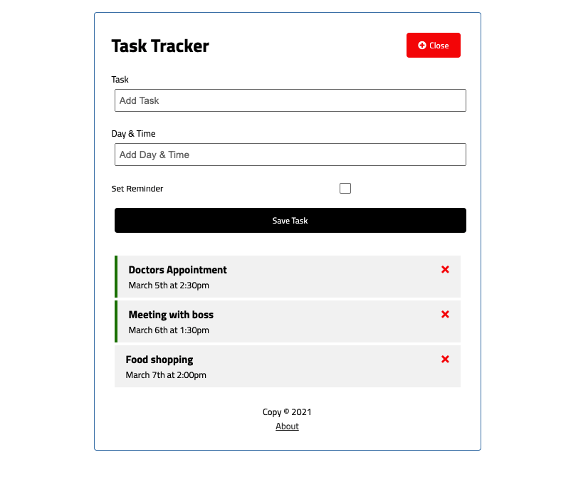

# Vue 3 Task Tracker

> Create Task Tracker on Vue 3

[](https://nimb.ws/RQUaH9)

## Project setup
```
npm install
```

### Compiles and hot-reloads for development
```
npm run serve
```

### Compiles and minifies for production
```
npm run build
```

### Customize configuration
See [Configuration Reference](https://cli.vuejs.org/config/).
